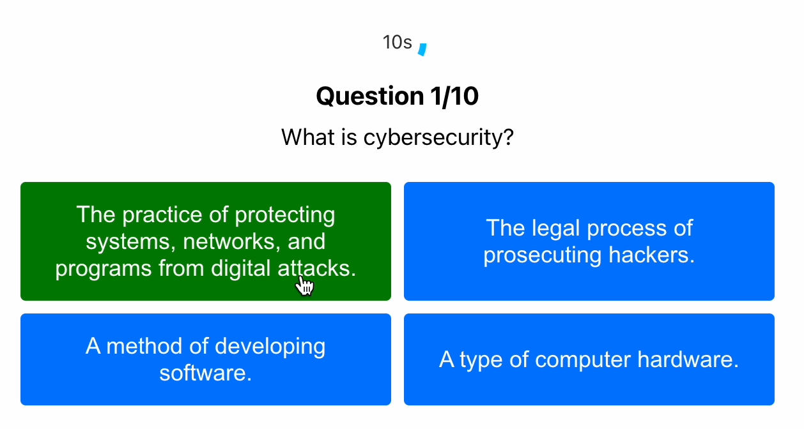

# Cybersecurity Quiz App

## Watch the Demo Video

Click on the thumbnail below to preview the video:

[](https://pages.uoregon.edu/fosei/110/images/milestone.mp4)

## Introduction
The Cybersecurity Quiz App is an interactive web application designed to test and enhance your knowledge of cybersecurity fundamentals. Featuring a range of questions from basic concepts to more advanced topics, this app provides a challenging and engaging way for users to learn about cybersecurity. With a dynamic question order and a visual countdown for each question, the quiz offers a unique and interactive experience.

## Features
- **Dynamic Question Order:** Each quiz session presents questions in a randomized order, ensuring a fresh experience for repeat attempts.
- **Countdown Timer:** Each question is timed with a visual circular countdown timer, adding a level of urgency and gamification.
- **Responsive Design:** The app is fully responsive and provides a seamless experience on both desktop and mobile devices.
- **Immediate Feedback:** Users receive immediate visual feedback on their answers, with correct answers highlighted in green and incorrect ones in red.
- **Score Tracking:** At the end of each quiz session, users can see their total score, allowing them to track their progress over time.

## Technologies Used
- React.js
- CSS
- HTML
- SVG for countdown timer

## Setup and Installation
To set up the quiz app on your local machine, follow these steps:

1. **Clone the repository:**
   ```bash
   git clone https://github.com/attajunyah/cybersecurity-quiz-app.git
   ```
2. **Navigate to the project directory:**
   ```bash
   cd cybersecurity-quiz-app
   ```
3. **Install dependencies:**
   ```bash
   npm install
   ```
4. **Start the application:**
   ```bash
   npm start
   ```

## How to Use
1. **Start the Quiz:** Upon loading the app, click the 'Start Quiz' button to begin.
2. **Answer Questions:** Select your answer for each question before the time runs out. The circular timer provides a visual representation of the remaining time.
3. **View Your Score:** After completing the quiz, your score will be displayed, allowing you to see how well you performed.
4. **Retry:** You can start a new quiz session anytime by refreshing the app or clicking on a 'Restart Quiz' button if implemented.

## Contributing
Contributions to the Cybersecurity Quiz App are welcome. Please feel free to fork the repository, make improvements, and submit pull requests.

## License
This project is licensed under the MIT License - see the [LICENSE.md](LICENSE) file for details.
